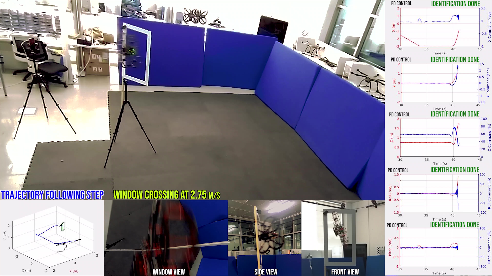

# DNN-MRFT: Real-time full system identification and optimal controller tuning for UAVs using the Modified Relay Feedback Test and Deep Neural Networks.

[](https://www.youtube.com/watch?v=NH58HskNqk4)

This is the code for the 2020 IEEE-access paper: [Real-Time System Identification Using Deep Learning for Linear Processes With Application to Unmanned Aerial Vehicles](https://ieeexplore.ieee.org/abstract/document/9130679) and the pre-print: [Multirotors from Takeoff to Real-Time Full Identification Using the Modified Relay Feedback Test and Deep Neural Networks](Multirotors from Takeoff to Real-Time Full Identification Using the Modified Relay Feedback Test and Deep Neural Networks).

## Running examples

### Attitude and Altitude SOIPTD channels: [IEEE access paper](https://ieeexplore.ieee.org/abstract/document/9130679).

1. Finding the distinguishing phase, parameter space discretization, and training data generation:
**Run the script**:
```
Testing scripts/SOIPTD_discretization.m
```

2. Deep Neural Network Training:
**Run the script**:
```
Testing scripts/train_DNN_inner.m
```

### Full UAV control channels (with Cascaded position or velocity loops): [pre-print](https://arxiv.org/abs/2010.02645).

1. Finding the distinguishing phase, parameter space discretization, and training data generation:
**Run the script**:
```
Testing scripts/cascaded_DNN_MRFT.m
```

2. Deep Neural Network Training:
**Run the script**:
```
Testing scripts/train_DNN_outer.m
```

### Simulation Evaluation.

To evaluate the performance of DNN-MRFT on ground truth simulation data, refer to the following scripts:
**Run the script**:
```
1. Testing scripts/cascaded_MRFT_test.m: Test the performance of the full DNN-MRFT approach for both inner and outer loop system identification on a signle ground truth model parameters specified by the user.
2. Testing scripts/DNN_MRFT_test.m: Test the performance of the full DNN-MRFT approach for both inner and outer loop system identification on a set of model parameters randomized from a parameter space specified by the user.
```

### Simulation Evaluation.

The scripts that apply DNN-MRFT to experimental data, both offline and in real-time will be uploaded to a different repository.

## Additional Notes

Feel free to contact the repository owner if you need the pre-trained DNN models, or any of the intermediate data forms (discretized parameters space, distinguishing phase, ...).

